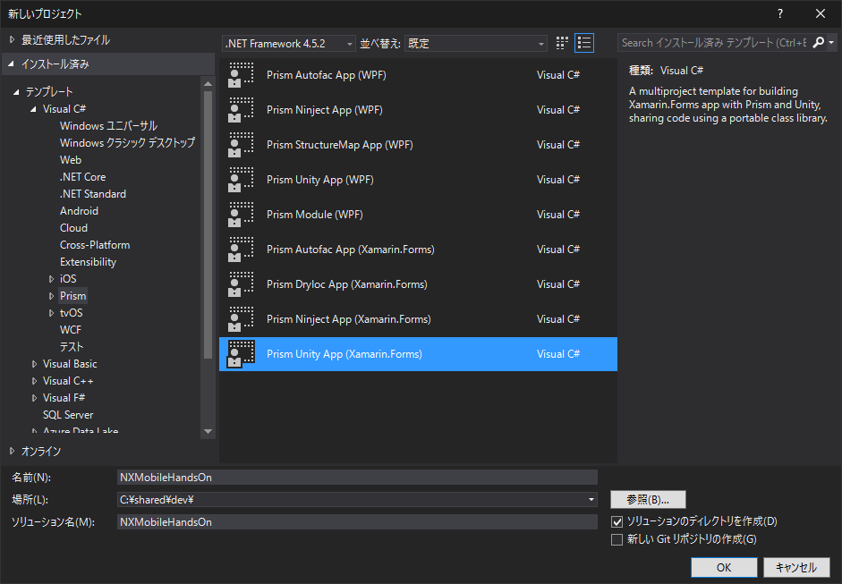
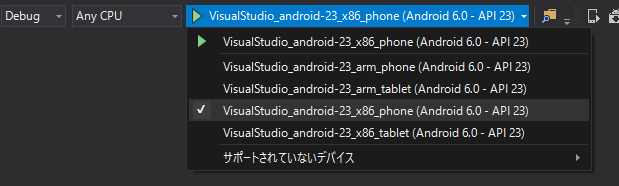
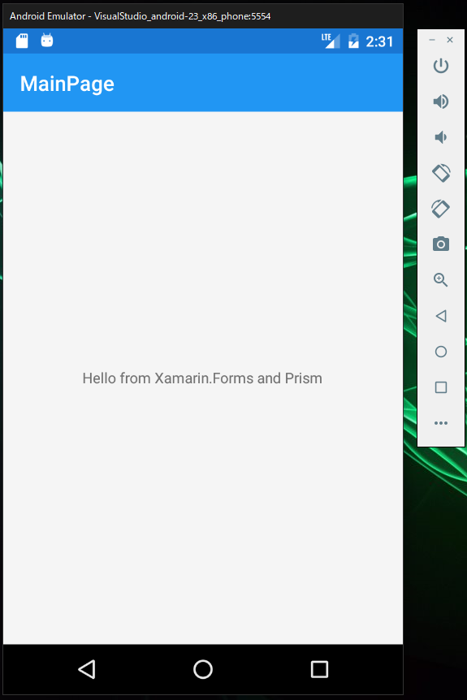
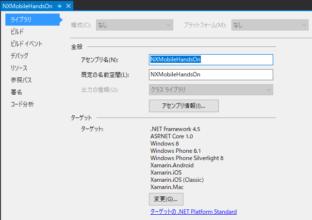
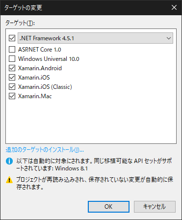
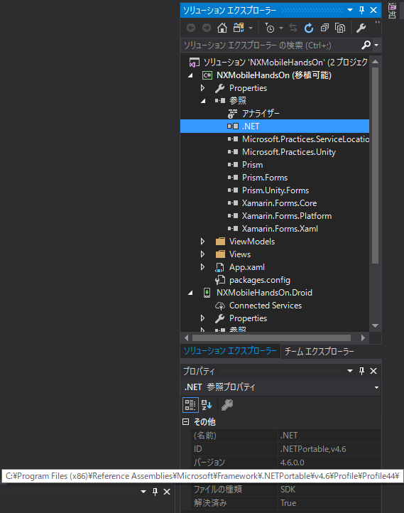
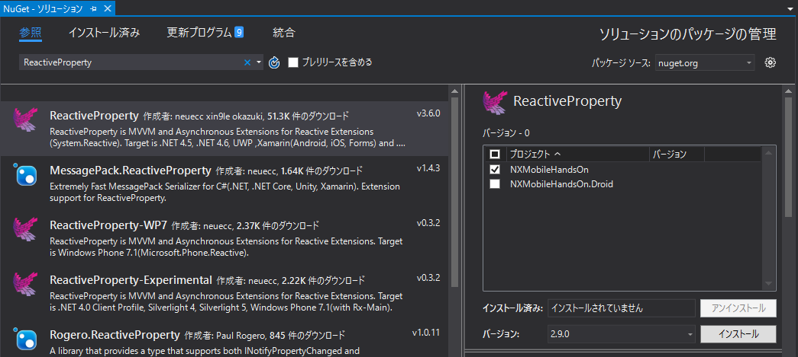

## Prism Template Pack のインストール

Prism プロジェクトを１から作ると手間がかかるので、テンプレートを用いてプロジェクトを作成します。  
Visual Studio Marketplace から Prism Template Pack をダウンロード・インストールしてください。  

[Prism Template Pack - Visual Studio Marketplace](https://marketplace.visualstudio.com/items?itemName=BrianLagunas.PrismTemplatePack)

## プロジェクトの作成

Visual Studio から新規プロジェクトを作成します。

今回は Android を対象にします。

## エミュレータの起動確認

開発の前に、エミュレータが正しく動くことを確認します。

Androidプロジェクト `NXMobileHandsOn.Droid` をスタートアップ プロジェクトに指定してください。
次にデバッガの選択項目から `VisualStudio_android-23_x86_phone (Android 6.0 - API 23)` を選択し、エミュレータでのデバッグを確認してください。

Androidエミュレータ上で "Hello from Xamarin.Forms and Prism" と表示されたら成功です。

最初の動作確認は以上ですが、エミュレータは今後も使用するので終了しないでください。  
（起動に時間がかかるので…）

## プロジェクトの初期設定

PCLプロジェクトの Profile を変更します。  
（この作業により設定を変更しないと、WCFアクセスを行うことができません。）  

PCLプロジェクト（「移植可能」と書いてあるプロジェクト）を右クリックし、プロパティを開きます。

`ライブラリ` > `ターゲット` > `変更ボタン` をクリックしてください。

ターゲットの変更ウィンドウにて、次の手順で操作をしてください。  
（手順を間違えると想定通りの設定にならないことがあります）

1. `.NET Framework 4.5` を `.NET Framework 4.5.1` に変更する
2. `ASP.NET Core 1.0` のチェックを外す
3. `OK` ボタンを押して閉じる

PCLプロジェクトの `参照` を展開し、`.NET` のプロパティを確認してください。
`パス` の末尾が `Profile44` となっていれば成功です。

※ Xamarin では、ターゲット プラットフォーム の組み合わせにより使用できる .NET の機能が制限されます。  
　 `Profile 44` は WFCの機能が入った組み合わせの１つです。

## ReactiveProperty のインストール

[ReactiveProperty](https://github.com/runceel/ReactiveProperty) を使うと View - ViewModel 間のデータバインディングやコマンドの作成が簡単にできます。

ソリューション エクスプローラー から、`ソリューション 'NXMobileHandsOn' (2 プロジェクト)` を右クリックし、`ソリューションの NuGet パッケージの管理` をクリックしてください。

`NuGet - ソリューション` 画面の `参照` タブ(?) にて、`ReactiveProperty` を検索してください。

見つかったら、`NXMobileHandOn` プロジェクトにチェックを入れ、バージョン: `2.9.0` を選択し インストールを実行してください。  
（.NET Framework 4.5.1 の場合、3.0.0 以上のバージョンをインストールすることはできません）

