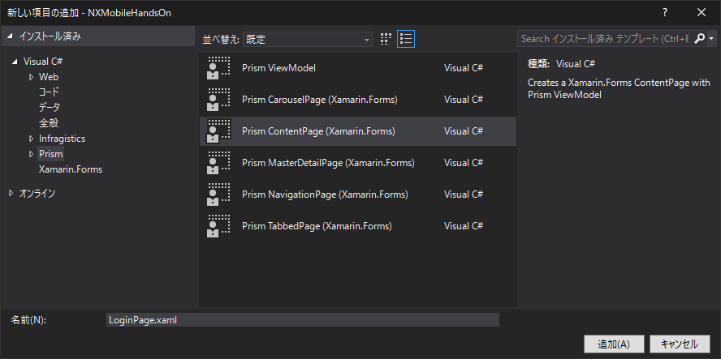
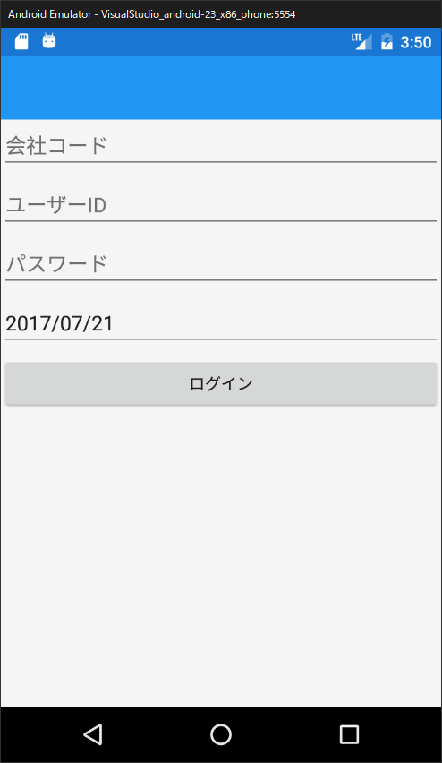

## 機能構成

画面 `LoginPage` と `MenuPage` を作ります。  
アプリを起動すると、ログイン画面 `LoginPage` が開き、アカウントを入力しログインに成功すると `MenuPage` に遷移する、というイメージです。

`LoginPage` には、入力欄 `会社コード` `ユーザーID` `パスワード` `ログイン日付` と ログイン用のボタンを用意します。  
ログインボタンを押すと入力値の検証がされ、ValidであればNXのログインサービスを呼び出します。

## ファイル(View, ViewModel)の作成

PCLプロジェクトの `Views` フォルダを右クリックし `追加` > `新しい項目` を選択してください。

新しい項目の追加画面にて、`Visual C#` > `Prism` > `Prism ContentPage (Xamarin.Forms) ` を選択してください。  
またファイル名は `LoginPage.xaml` とし、`追加` でファイルを作成してください。  
（ファイル名はこの通りにしてください）  


`Views` フォルダの中に `LoginPage.xaml` が作成されると同時に、`ViewModels` フォルダの中に `LoginPageViewModel.cs` ファイルが生成されたことを確認してください。

## デフォルト実行画面の指定

特に設定をしないと、アプリの実行時にはプロジェクト作成時に自動生成された `MainPage` が表示されます。  
今回は起動時に `LoginPage` を表示したいので設定を変更します。

`App.xaml.cs` を開いてください。（`App.xaml` を展開するとあります）

`OnInitialized` メソッドの `NavigationService.NavigateAsync` の処理を以下のように書き換えてください。

```cs
NavigationService.NavigateAsync("NavigationPage/LoginPage");
```

これで起動時には `LoginPage` が表示されるようになります。

`MainPage` は使用しないので、ついでに `RegisterTypes` メソッド内の処理から `MainPage` の行を削除しておきましょう。

これで、`App.xaml.cs`の中身は以下のようになっているはずです。

```cs
using Prism.Unity;
using NXMobileHandsOn.Views;
using Xamarin.Forms;

namespace NXMobileHandsOn
{
    public partial class App : PrismApplication
    {
        public App(IPlatformInitializer initializer = null) : base(initializer) { }

        protected override void OnInitialized()
        {
            InitializeComponent();

            NavigationService.NavigateAsync("NavigationPage/LoginPage");
        }

        protected override void RegisterTypes()
        {
            Container.RegisterTypeForNavigation<NavigationPage>();
            Container.RegisterTypeForNavigation<LoginPage>();
        }
    }
}
```

## LoginPage画面の作成

ログインページに部品を配置していきます。

`LoginPage.xaml` を開いてください。

今回は `StackLayout` を使用して画面を組み立てます。

XAMLの `<ContentPage>` の中に、`<StackLayout>` を記述してください。

```xml
<StackLayout>

</StackLayout>
```

`会社コード` `ユーザーID` `パスワード` の入力コントロール `<Entry>` をそれぞれ配置してください。  
また、パスワード欄には `IsPassword="True"` プロパティを指定してください。これを指定することで、アプリ画面上で入力値が「***」のように表示されます。

```xml
<StackLayout>
    <Entry x:Name="EntryKaiCode" Placeholder="会社コード" />
    <Entry x:Name="EntryUserId" Placeholder="ユーザーID" />
    <Entry x:Name="EntryPassword" Placeholder="パスワード" IsPassword="True" />
</StackLayout>
```

`ログイン日付` を選択するためのコントロール `DatePicker` を配置してください。  
`DatePicker` では、アプリ画面でコントロールを選択すると、OSに組み込まれた日付選択機能が表示されます。

```xml
<StackLayout>
    <Entry x:Name="EntryKaiCode" Placeholder="会社コード" />
    <Entry x:Name="EntryUserId" Placeholder="ユーザーID" />
    <Entry x:Name="EntryPassword" Placeholder="パスワード" IsPassword="True" />
    <DatePicker x:Name="DpLoginDate" Format="yyyy/MM/dd" />
</StackLayout>
```

最後にログインボタンを配置します。

```xml
<StackLayout>
    <Entry x:Name="EntryKaiCode" Placeholder="会社コード" />
    <Entry x:Name="EntryUserId" Placeholder="ユーザーID" />
    <Entry x:Name="EntryPassword" Placeholder="パスワード" IsPassword="True" />
    <DatePicker x:Name="DpLoginDate" Format="yyyy/MM/dd" />
    <Button x:Name="BtnLogin" Text="ログイン" />
</StackLayout>
```

デバッグを開始して、画面の表示を確認します。

以下の通りの画面が表示されれば成功です。

