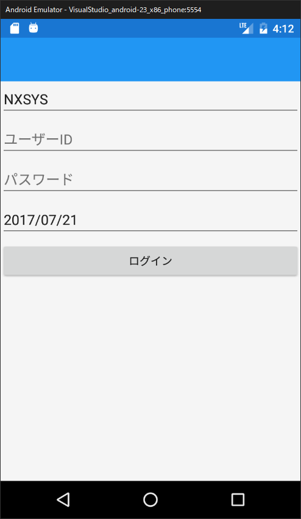

## View-ViewModelのプロパティのバインディング

View(LoginPage.xaml)とViewModel(LoginPageViewModel.cs)でプロパティの値を共有できるようにします。

### 会社コード欄のバインディング

`LoginPageViewModel.cs` を開いてください。

まずは 会社コード のプロパティを作成します。  
`LoginPageViewModel` クラス内に、`ReactiveProperty<string>`型のプロパティを作成してください。

```cs
    public class LoginPageViewModel : BindableBase
    {
        public ReactiveProperty<string> KaiCode { get; set; }
            = new ReactiveProperty<string>();
        ...
```

プロパティを作成したので、View(LoginPage.xaml) の会社コード入力欄とバインディングをします。  
`LoginPage.xaml`を開いて、会社コード欄を下記のように変更してください。  
（`KaiCode`の後に`.Value`を付けるのを忘れないでください。慣れないとよく忘れます…）

```xml
<Entry x:Name="EntryKaiCode" Placeholder="会社コード" Text="{Binding KaiCode.Value}" />
```

これでViewとViewModelの`KaiCode`がバインディングされました。  
（`ReactiveProperty<T>`は`INotifyPropertyChanged`を実装しており、明示的な`OnPropertyChanged`などの呼び出しは不要です。）

試しに ViewModel(LoginPageViewModel.cs) のコンストラクタにて、会社コードの初期値を設定してみます。

```cs
    public class LoginPageViewModel : BindableBase
    {
        public ReactiveProperty<string> KaiCode { get; set; }
            = new ReactiveProperty<string>();

        public LoginPageViewModel()
        {
            KaiCode.Value = "NXSYS";
        }
    }
```

デバッグを開始して動作を確認してください。  
会社コード欄に「NXSYS」が表示されていればバインディング成功です。



### ユーザーID・パスワード・ログイン日付のバインディング

会社コードと同じように、ユーザーID・パスワード・ログイン日付の入力欄もバインディングしておきます。

`LoginPageViewModel.cs`に、`UserId`, `Password`, `LoginDate` のプロパティを追加してください。  
（`LoginDate`は日付なので、`ReactiveProperty<DateTime>`型にしてください）

```cs
    public class LoginPageViewModel : BindableBase
    {
        // 会社コード
        public ReactiveProperty<string> KaiCode { get; set; }
            = new ReactiveProperty<string>();

        // ユーザーID
        public ReactiveProperty<string> UserId { get; set; }
            = new ReactiveProperty<string>();

        // パスワード
        public ReactiveProperty<string> Password { get; set; }
            = new ReactiveProperty<string>();

        // ログイン日付
        public ReactiveProperty<DateTime> LoginDate { get; set; }
            = new ReactiveProperty<DateTime>();

        public LoginPageViewModel()
        {
            KaiCode.Value = "NXSYS";
        }
    }
```

`LoginPage.xaml`の各入力欄に、プロパティのバインディングの指定を追加してください。

```xml
    <StackLayout>
        <Entry x:Name="EntryKaiCode" Placeholder="会社コード" Text="{Binding KaiCode.Value}" />
        <Entry x:Name="EntryUserId" Placeholder="ユーザーID" Text="{Binding UserId.Value}" />
        <Entry x:Name="EntryPassword" Placeholder="パスワード" IsPassword="True" Text="{Binding Password.Value}" />
        <DatePicker x:Name="DpLoginDate" Format="yyyy/MM/dd" Date="{Binding LoginDate.Value}" />
        <Button x:Name="BtnLogin" Text="ログイン" />
    </StackLayout>
```