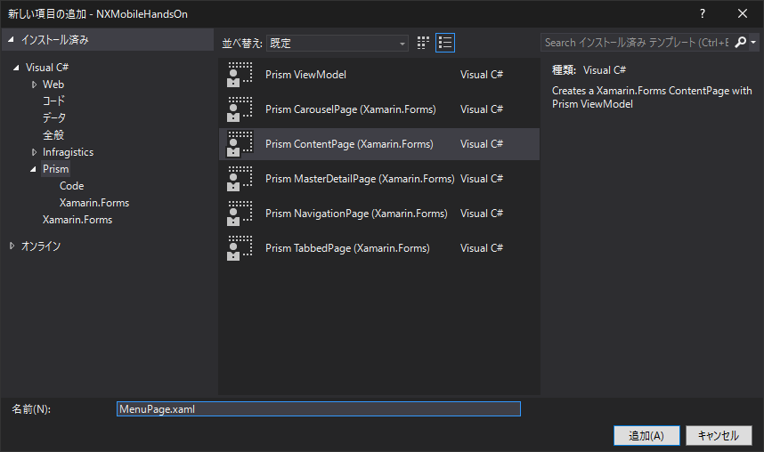
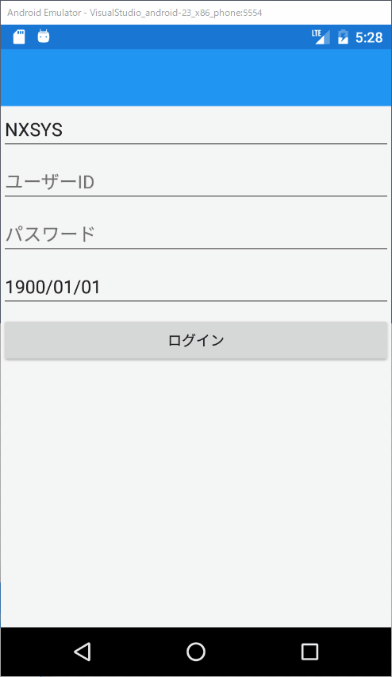

# ログインボタン処理の作成

ログインボタンを押すとバリデーション・ログインサービスの呼び出しが行われ、成功すると次の画面に遷移する想定です。

まずは難しい処理は行わず、画面の遷移だけを行う処理を作成します。

## メニュー画面の作成

遷移先の画面 `MenuPage` を作成します。  
（ログインをしたらメニュー画面を表示したい、という意味で「MenuPage」という名前にしていますが、（時間の都合で）実際には何もない画面を作成します）

`LoginPage.xaml`を作った時と同じように、`NXMobileHandsOn`プロジェクトの`Views`フォルダの中に、Prismのテンプレートから `MenuPage.xaml` を作成してください。



`MenuPage.xaml`に、メニューページだとわかるように、タイトルを設定しておきます。

```xml
<?xml version="1.0" encoding="utf-8" ?>
<ContentPage xmlns="http://xamarin.com/schemas/2014/forms"
             xmlns:x="http://schemas.microsoft.com/winfx/2009/xaml"
             xmlns:prism="clr-namespace:Prism.Mvvm;assembly=Prism.Forms"
             prism:ViewModelLocator.AutowireViewModel="True"
             x:Class="NXMobileHandsOn.Views.MenuPage"
             Title="メニューページ">
  
</ContentPage>
```

## ボタン処理の作成（仮）

画面遷移の処理を作る前に、ログインボタンを押したら何らかの処理が実行される処理を作成しておきます。

以下のように、ログイン画面(LoginPageViewModel.cs)にボタン処理のコマンド（プロパティ）を作成してください。

```cs
        // ログインボタンの処理
        public ReactiveCommand LoginCommand { get; set; }
            = new ReactiveCommand();
```

次に、ログインボタンが押されたときに実行されるメソッドを作成します。  
メソッド名は好きな名前で構いませんが、`object`型の引数を１つ取るようにする必要があります。

```cs
        // ログインボタンの押下時処理
        private void LoginButtonTapped(object sender)
        {

        }
```

作成した `LoginCommand`と`LoginButtonTapped`メソッドを紐付けます。  
コンストラクタにて `LoginCommand.Subscribe`メソッドを発行し、引数に `LoginButtonTapped` を指定してください。
（`ReactiveCommand`の`Subscribe`メソッドで、コマンドと実行処理を結びつけます）

```cs
        public LoginPageViewModel()
        {
            KaiCode.Value = "NXSYS";
            LoginCommand.Subscribe(LoginButtonTapped);
        }
```

最後に、View(LoginPage.xaml)にて、ログインボタンの `Command` プロパティに ViewModel で作成したReactiveCommandプロパティ`LoginCommand`を指定します。

```xml
<Button x:Name="BtnLogin" Text="ログイン" Command="{Binding LoginCommand}" />
```

動作を確認します。  
ボタンが押されると実際に ViewModel の `LoginButtonTapped` が呼び出されることを確認するために、`LoginButtonTapped`の中にブレークポイントを設置してください。  
そしてデバッグを開始し、ボタンを押してみてください。`LoginButtonTapped`の中のブレークポイントで処理が停止すれば成功です。


## 遷移処理の作成

ログインボタンを押すと ViewModel の `LoginButtonTapped`メソッドが呼び出されるようになりました。  
次は、実際に画面を遷移させる処理を作成します。

`LoginPageViewModel.cs` に `_navigationService`変数を追加し、コンストラクタを次のように変更してください。

```cs
        // NavigationService
        private INavigationService _navigationService;

        // navigationSeriviceはDIコンテナによって自動的にInjectされる。
        // 命名規約によって動作するため、引数は「navigationService」という名前である必要ががある
        public LoginPageViewModel(INavigationService navigationService)
        {
            KaiCode.Value = "NXSYS";
            LoginCommand.Subscribe(LoginButtonTapped);
            _navigationService = navigationService;
        }
```

コンストラクタに `INavigationService navigationService` が追加されました。これを使用してページの遷移を行います。
`LoginPageViewModel`を使用する際、開発者は引数を指定して`LoginPageViewModel`のコンストラクタを呼ぶ必要はありません。  
画面を表示しようとしたとき、PrismのDIコンテナが自動的に `navigationService`引数に値をセットした状態でコンストラクタを呼び出します。

現在、`App.xaml.cs`の`RegisterTypes`メソッドに以下の処理が書かれています。

```cs
Container.RegisterTypeForNavigation<LoginPage>();
```
この処理が書かれていると、指定したページを表示する際にコンストラクタの `navigationService` 引数に値をセットして呼び出す、という仕組みです。

遷移処理を作成します。

画面の遷移を行うには、`navigationService`の`NavigateAsync`メソッドを呼ぶだけです。  
`LoginPageViewModel.cs`にて、ログインボタンを押したときの動作`LoginButtonTapped`メソッドの中に以下のように遷移処理を書いてください。

```cs
        // ログインボタンの押下時処理
        private void LoginButtonTapped(object sender)
        {
            _navigationService.NavigateAsync("MenuPage");
        }
```

`LoginPage`から`MenuPage`に遷移するため、遷移先の名前`MenuPage`を引数に指定しています。

デバッグを開始して、動作を確認してください。

ログインボタンを押して画面が移動すれば成功です。

