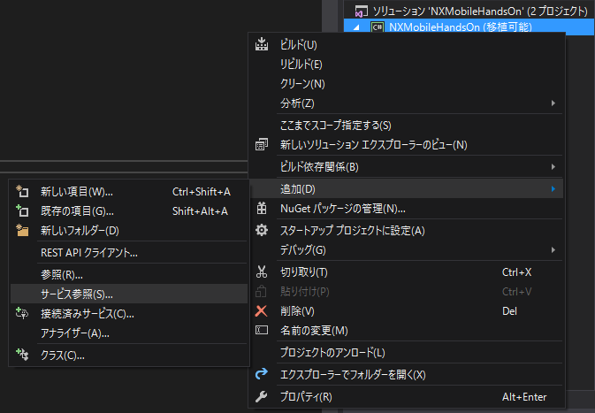
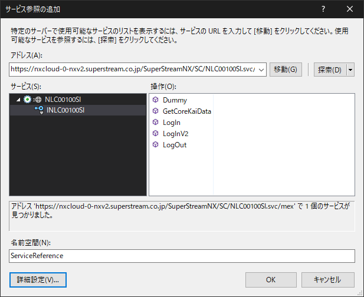
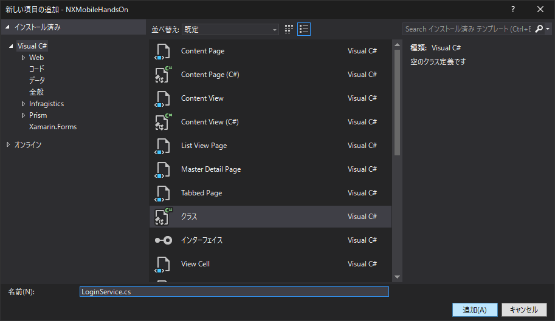
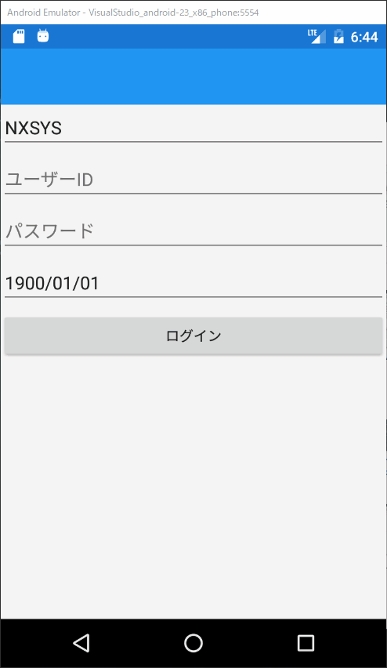

# ログインサービスへのアクセス

ログインボタンを押したらNXのログインサービスを呼ぶ処理を作成します。

基本的なWebサービスへのアクセス手順はNXV2と同じです。  
（WCFを標準でサポートしていない Profile の場合は異なります。）

## サービス参照の追加

ログインサービス `NLC00100SI` への参照をプロジェクトに追加します。

今回は以下のURLを使用します。

`https://nxcloud-0-nxv2.superstream.co.jp/SuperStreamNX/SC/NLC00100SI.svc`

PCLプロジェクトを右クリック > 追加 > サービス参照 を選択してください。



アドレス欄にURLを入力し、 `移動` を押してください。  
サービスの探索に成功したら、名前空間を `ServiceReference` に変更し `OK` を押して画面を閉じてください。



## ログイン処理クラスの作成

`NLC00100SI`からログイン処理を呼び出すためのクラスを作成します。

PCLプロジェクトに、新規クラス `LoginService.cs` を作成してください。



`LoginService`の中でサービスを呼び出すための設定処理を作成します。
`LoginService`クラスを以下のように作成してください。

仕組みは既存のNXと同じ、かつXamarin自体の仕組みとは全く関係がないので、何も考えずコピペして構いません。

```cs
/* LoginService.cs */
    public class LoginService
    {
        public static readonly EndpointAddress EndPoint
            = new EndpointAddress("https://nxcloud-0-nxv2.superstream.co.jp/SuperStreamNX/SC/NLC00100SI.svc");

        private INLC00100SI client;

        public LoginService()
        {
            BasicHttpBinding binding = CreateBasicHttp();
            client = new NLC00100SIClient(binding, EndPoint);
        }

        private static BasicHttpBinding CreateBasicHttp()
        {
            BasicHttpBinding binding = new BasicHttpBinding
            {
                Name = "basicHttpBinding",
                MaxBufferSize = 2147483647,
                MaxReceivedMessageSize = 2147483647
            };
            TimeSpan timeout = new TimeSpan(0, 0, 30);
            binding.SendTimeout = timeout;
            binding.OpenTimeout = timeout;
            binding.ReceiveTimeout = timeout;
            return binding;
        }
    }
```

ここで、普段のNXなら `client`を`NLC00100SIClient`型で作成し、`client.LoginV2Completed += CallbackMethod`などとしてコールバック処理を登録し、`client.LoginV2Async()`を呼び出すところですが…  
`LoginV2Completed`のようなイベントを使ったコールバックでは、ViewModel からログイン処理を呼び出した後の処理が大変なので、`Task<T>`を使ったパターンに変換しておきます。  
（ViewModel側で例外処理を行うこともできないし…）

`LoginService.cs` 呼び出し処理 `LoginAsync` を作成します。

```cs
/* LoginService.cs */
        public async Task<NLC00100SIParamV2> LoginAsync(string kaiCode, string userId, string password, DateTime loginDate)
        {
            var param = new NLC00100SIParamV2();
            param.KaiCode = kaiCode;
            param.UsrID = userId;
            param.Pswd = password;
            param.LoginDate = loginDate;

            var task = new TaskFactory().FromAsync(client.BeginLogInV2, client.EndLogInV2, param, null);
            return await task;
        }
```

このメソッドでは、引数から `会社コード` `ユーザーID` `パスワード` `ログイン日付` を取得しパラメータオブジェクトを作成します。
現在のNXのWebサービスのクライアント処理は、内部に `BeginXxx` `EndXxx` というメソッドを持っており、この場合は `Task`を使ったパターンに変換が可能です。

ViewModelで`LoginAsync`メソッドを呼び出すと、`NLC00100SIParamV2`型の実行結果が返るという想定です。

実際にViewModelからログイン処理を呼び出してみます。

`LoginPageViewModel.cs` の `LoginButtonTapped`メソッドを、以下のように書き換えてください。  
ここではログイン処理中に画面が固まらないように非同期で処理を呼んでいます。  
メソッドの定義に `async` を追加していることに注意してください。

```cs
/* LoginPageViewModel.cs */
        // ログインボタンの押下時処理
        private async void LoginButtonTapped(object sender)
        {
            var loginService = new LoginService();
            NLC00100SIParamV2 result = null;
            try
            {
                // ログインサービスの呼び出し
                result = await loginService.LoginAsync(KaiCode.Value, UserId.Value, Password.Value, LoginDate.Value);
            }
            catch (Exception ex)
            {

            }

            // ログインに成功すると認証キー'NshKey'が設定される
            if (result?.NshKey != null)
            {
                await _navigationService.NavigateAsync("MenuPage");
            }
        }
```

`NLC00100SI`では、ログインに成功した場合のみ実行結果のパラメータに 認証キー`NshKey` が設定されます。  
認証キーが設定されているかどうかでログインの成否を判定し、成功していれば `MenuPage` に遷移するようにしています。

これでNXのサーバへのアクセス自体はできましたが（必ずログインに失敗しますが）、ログインに失敗した場合は何も処理をしていないので、ユーザーには失敗したことがわかりません。  
失敗した場合には、画面にエラーメッセージを表示するようにしておきます。

`LoginPageViewModel.cs` にエラーメッセージ用のプロパティを追加してください。

```cs
/* LoginPageViewModel.cs */
        // エラーメッセージ
        public ReactiveProperty<string> ErrorMessage { get; set; }
            = new ReactiveProperty<string>();
```

作成した `ErrorMessage` プロパティに、ログインの失敗時にメッセージを設定するよう処理を追加します。
`LoginButtonTapped`メソッドを以下のように書き換えてください。

```cs
/* LoginPageViewModel.cs */
        // ログインボタンの押下時処理
        private async void LoginButtonTapped(object sender)
        {
            var loginService = new LoginService();
            NLC00100SIParamV2 result = null;
            try
            {
                // ログインサービスの呼び出し
                result = await loginService.LoginAsync(KaiCode.Value, UserId.Value, Password.Value, LoginDate.Value);
            }
            catch (Exception ex)
            {
                ErrorMessage.Value = ex.Message;
            }

            // ログインに成功すると認証キー'NshKey'が設定される
            if (result?.NshKey != null)
            {
                ErrorMessage.Value = string.Empty;
                await _navigationService.NavigateAsync("MenuPage");
            }
            else
            {
                ErrorMessage.Value = result.clientMessageList.FirstOrDefault().StatusMessage;
            }
        }
```
ここでは、例外が発生した場合には例外オブジェクトからエラーメッセージを取得、サーバへのアクセスに成功したもののログインに失敗した場合は処理結果オブジェクトからエラーメッセージを取得し、`ErrorMessage`プロパティに値を設定しています。

次に `LoginPage.xaml` にて、エラーメッセージを表示するためのラベルを配置します。

```xml
<!-- LoginPage.xaml -->
    <StackLayout>
        <Entry x:Name="EntryKaiCode" Placeholder="会社コード" Text="{Binding KaiCode.Value}" />
        <Entry x:Name="EntryUserId" Placeholder="ユーザーID" Text="{Binding UserId.Value}" />
        <Entry x:Name="EntryPassword" Placeholder="パスワード" IsPassword="True" Text="{Binding Password.Value}" />
        <DatePicker x:Name="DpLoginDate" Format="yyyy/MM/dd" Date="{Binding LoginDate.Value}" />
        <Button x:Name="BtnLogin" Text="ログイン" Command="{Binding LoginCommand}" />
        <Label x:Name="LblErroMessage" Text="{Binding ErrorMessage.Value}" TextColor="Red" />
    </StackLayout>
```

エミュレータ上で動作を確認してみます。  
ログインボタンを押して「ログイン情報に誤りがあります。ログインできません。」と表示されたら成功です。  
（NXのサーバから返されたエラーメッセージなので、通信に成功していることになります。）

